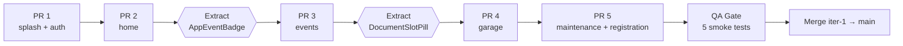
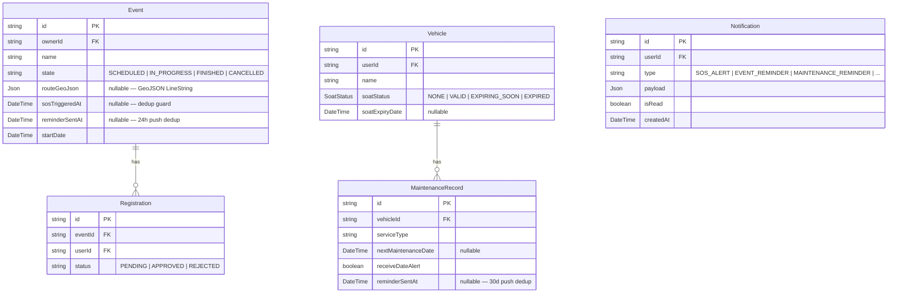
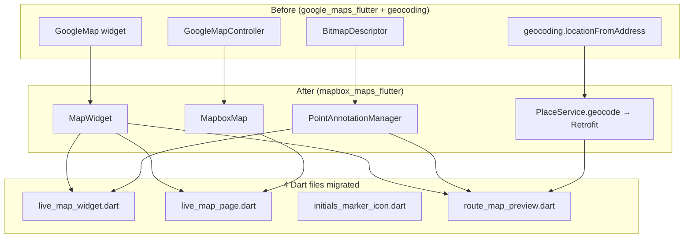
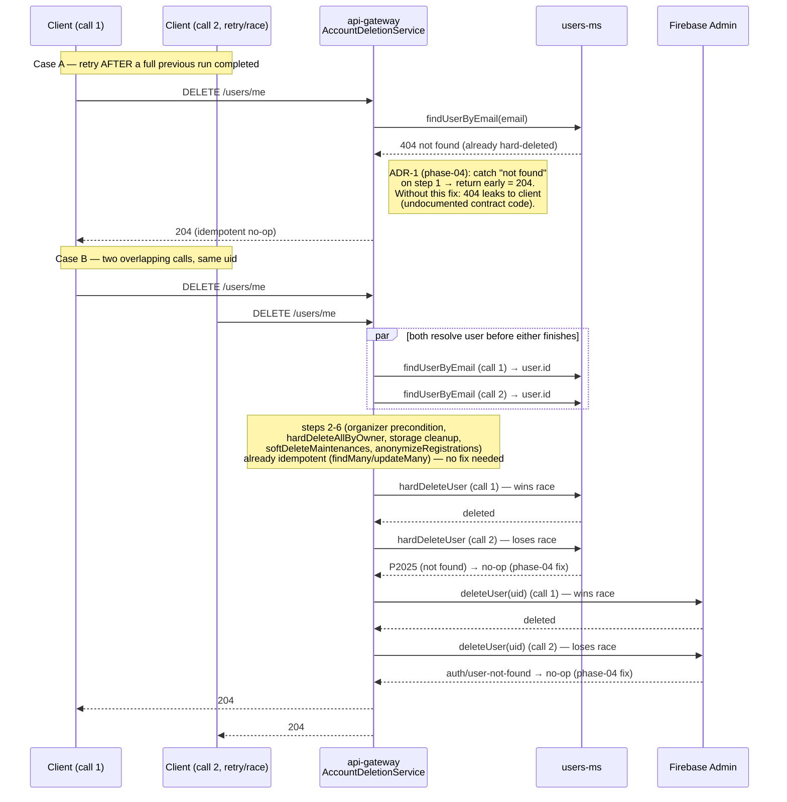
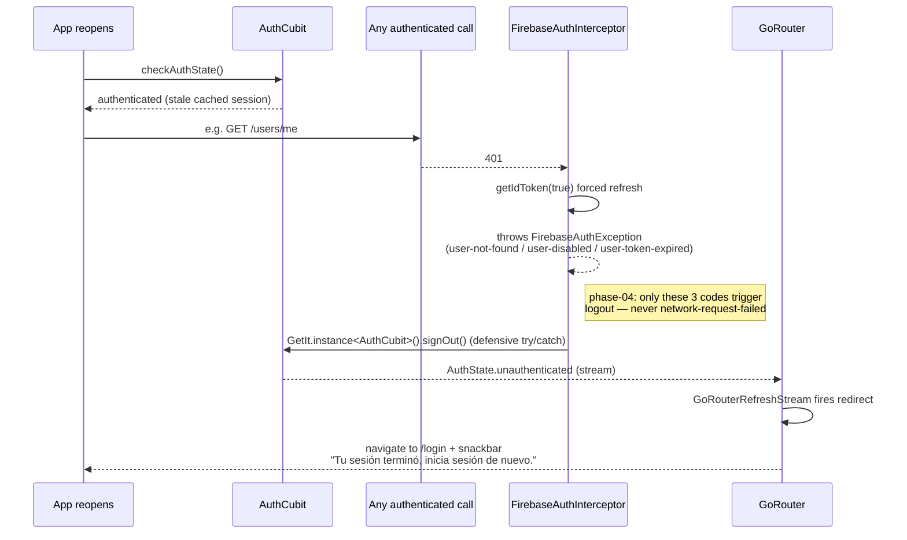

# Architecture Diagrams — Rideglory

> Living document. Updated by Architect each iteration when component hierarchies, boundaries, or data models change.

---

## Iteration 1 — UI/UX Redesign (presentation layer only)

No data model changes this iteration. The diagrams below capture the **design system component hierarchy** as it stands after iter-1, including the two new primitives (`AppEventBadge` atom, `DocumentSlotPill` molecule) extracted from Pencil frames `zKkmE` and `aGqnv` respectively.

### Design system layering

```mermaid
graph TD
  subgraph Foundation
    Tokens["Tokens<br/>app_spacing · app_radius · app_size"]
    Theme["Theme<br/>app_colors · app_text_styles · app_theme"]
  end

  subgraph Atoms
    A_Btn[AppButton]
    A_TBtn[AppTextButton]
    A_TF[AppTextField]
    A_PWTF[AppPasswordTextField]
    A_DD[AppDropdown]
    A_DP[AppDatePicker]
    A_CB[AppCheckbox]
    A_MF[AppMileageField]
    A_CI[AppChipsInput]
    A_TFL[TextFieldLabel]
    A_IC[InfoChip]
    A_DPill[DetailPill]
    A_FC[AppFilterChip]
    A_AB[AppAppBar]
    A_LI[AppLoadingIndicator]
    A_C[AppCard]
    A_ST[AppSectionTitle]
    A_EB["AppEventBadge<br/>NEW · iter-1"]
  end

  subgraph Molecules
    M_AC[AppAutocompleteField]
    M_ACC[AppAutocompleteChipsField]
    M_CA[AppCityAutocomplete]
    M_SB[AppSearchBar]
    M_IP[AppImagePicker]
    M_RTE[AppRichTextEditor]
    M_AD[AppDialog]
    M_CD[ConfirmationDialog]
    M_ID[InfoDialog]
    M_ABS[AppBottomSheet]
    M_ESW[EmptyStateWidget]
    M_NSR[NoSearchResultsEmptyWidget]
    M_ARB[ApproveRejectBar]
    M_CPM[ContactPopupMenuButton]
    M_FSH[FormSectionHeader]
    M_CPR[ContainerPullToRefresh]
    M_DSP["DocumentSlotPill<br/>NEW · iter-1"]
  end

  Theme --> Atoms
  Tokens --> Atoms
  Atoms --> Molecules
  Theme --> Molecules
  Tokens --> Molecules

  A_Btn --> M_ARB
  A_TF --> M_AC
  A_TF --> M_ACC
  A_TF --> M_CA
  A_TF --> M_SB
  A_C --> M_DSP
  A_IC --> M_DSP
```



### Iter-1 consumer map for new primitives

```mermaid
graph LR
  subgraph DesignSystem
    AEB["AppEventBadge (atom)<br/>frame zKkmE"]
    DSP["DocumentSlotPill (molecule)<br/>frame aGqnv"]
  end

  subgraph EventsFeature
    EL[event_list_page]
    ED[event_detail_page]
    UPC[upcoming_events_card<br/>(Home)]
  end

  subgraph VehiclesFeature
    VD[vehicle_detail_page]
    VF[vehicle_form_page<br/>(non-functional placeholder)]
  end

  AEB --> EL
  AEB --> ED
  AEB --> UPC
  DSP --> VD
  DSP --> VF

  DSP -. "iter-2 reuse" .-> SOAT[soat_status_badge<br/>iter-2]
```

### Module-scoped PR sequence



### Color tokenization decision flow (per-file)

```mermaid
flowchart TD
  Start[Encountered Color literal<br/>in lib/features/] --> Q1{Has semantic<br/>role?}
  Q1 -- yes --> CS[Theme.of(context)<br/>.colorScheme.&lt;role&gt;]
  Q1 -- no --> Q2{Mapped in<br/>AppColors?}
  Q2 -- yes --> AC[AppColors.&lt;constant&gt;]
  Q2 -- no --> Q3{Status indicator?}
  Q3 -- yes --> ST[AppColors.success/<br/>warning/error/info]
  Q3 -- no --> Add[Add new constant<br/>to AppColors<br/>+ note in PR]
  CS --> Done
  AC --> Done
  ST --> Done
  Add --> Done[dart analyze]
```

---

## Iteration 3 — Tracking + SOS + Mapbox Migration

### ERD — Event model with iter-3 additions



### SOS alert sequence diagram

```mermaid
sequenceDiagram
    participant R as Rider (Flutter)
    participant GW as TrackingGateway (api-gateway)
    participant EMS as events-ms
    participant NS as NotificationService
    participant FCM as Firebase FCM
    participant Others as Other riders (Flutter)

    R->>R: Tap SOS button
    R->>R: SosConfirmDialog shown
    R->>R: Confirm → LiveTrackingCubit.triggerSos()
    R->>GW: WS message { type: "tracking.sos", data: { eventId, userId } }
    GW->>EMS: RPC markSosTriggered(eventId)
    alt sosTriggeredAt already set
        EMS-->>GW: { triggered: false }
        GW->>R: (no-op — silent deduplicate)
    else first SOS
        EMS->>EMS: SET sosTriggeredAt = now()
        EMS-->>GW: { triggered: true, fullName, phone?, latitude, longitude }
        GW->>GW: broadcast to WS room
        GW-->>Others: { type: "tracking.sos.alert", data: { userId, fullName, latitude, longitude, phone? } }
        GW->>NS: dispatch FCM multicast (approved registrant tokens)
        NS->>FCM: sendMulticast(tokens, payload)
        FCM-->>Others: Push notification "¡Alerta SOS! {fullName}"
        GW->>NS: insert notifications row (type: SOS_ALERT)
    end
    R-->>R: "SOS enviado" confirmation shown
    Others->>Others: SosBanner rendered; red pulsing marker on map
```

### Mapbox migration — SDK swap (Story 3.0)



---

## `DELETE /users/me` idempotency (eliminacion-cuenta-phase-04)

8-step orchestration in `AccountDeletionService.deleteAccount` (api-gateway). Diagram shows the
retry-after-full-completion case (step 1 gap found by phase-04) and the concurrent-race case
(steps 7-8).



Client-side session recovery (Flutter), when the account was fully deleted while the app was
closed:



## Change log

- 2026-07-11 (eliminacion-cuenta-phase-04): Added `DELETE /users/me` idempotency sequence diagrams
  (retry-after-completion + concurrent race) and the client-side forced-logout sequence. No ERD
  change — no schema/data model changes in this phase, only error-handling hardening.
- 2026-05-14 (iter-1): Initial diagrams document created. Captures design-system layering, new iter-1 primitives (`AppEventBadge`, `DocumentSlotPill`) and their consumers, module PR sequence, and color tokenization decision flow. No ERD or sequence diagrams — iter-1 introduces no new data models or async flows.
- 2026-05-15 (iter-3): Added ERD (Event + Registration + MaintenanceRecord + Vehicle + Notification with iter-3 fields: `routeGeoJson`, `sosTriggeredAt`, `reminderSentAt`, `soatStatus`, `soatExpiryDate`). Added SOS alert sequence diagram (WS → gateway → events-ms dedup → broadcast + FCM). Added Mapbox migration SDK-swap flowchart (4 Dart files, 4 type replacements).
