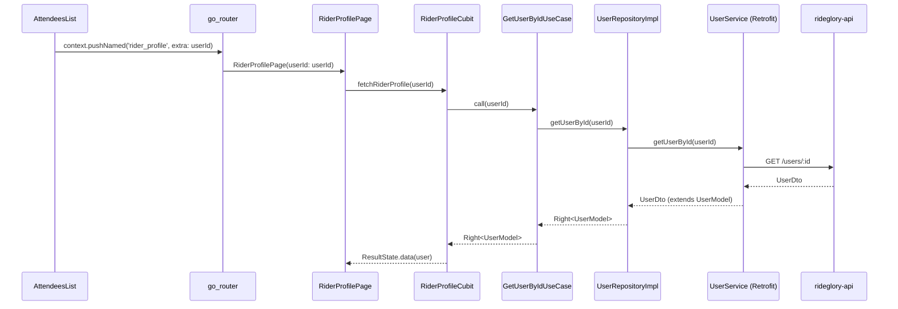
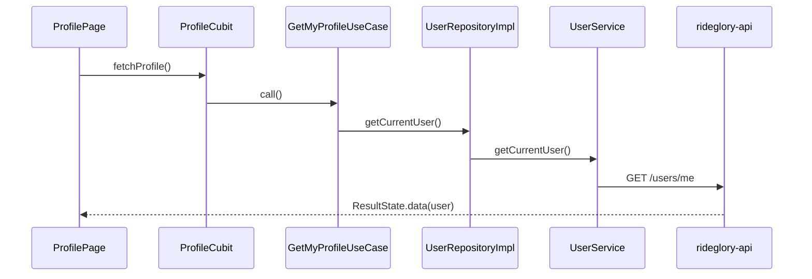

# Architecture Diagrams — Rideglory

## Iteration 2: Event Filter Flow (Backend Wire-Up)

```mermaid
sequenceDiagram
    participant UI as EventFiltersBottomSheet
    participant Cubit as EventsCubit
    participant UC as GetEventsUseCase
    participant Repo as EventRepositoryImpl
    participant Svc as EventService (Retrofit)
    participant API as rideglory-api

    UI->>Cubit: updateFilters(EventFilters)
    Cubit->>Cubit: _filters = filters
    Cubit->>Cubit: fetchEvents()
    Cubit->>UC: call(type?, dateFrom?, dateTo?, city?)
    UC->>Repo: getEvents(type?, dateFrom?, dateTo?, city?)
    Repo->>Svc: getEvents(@Query type, dateFrom, dateTo, city)
    Svc->>API: GET /events?type=X&dateFrom=Y&city=Z
    API-->>Svc: List<EventDto>
    Svc-->>Repo: List<EventDto>
    Repo-->>UC: Right<List<EventModel>>
    UC-->>Cubit: Right<List<EventModel>>
    Cubit->>Cubit: _allEvents = events; _applyFiltersAndEmit()
    Cubit-->>UI: ResultState.data(filtered)
```

## Iteration 2: Attendee → Rider Profile Navigation



## Iteration 1: Profile Fetch (Reference)


