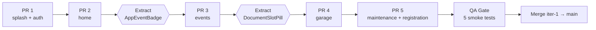
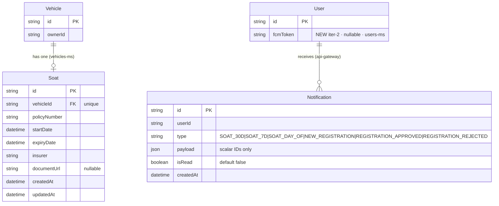
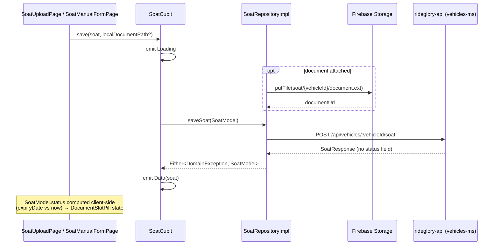
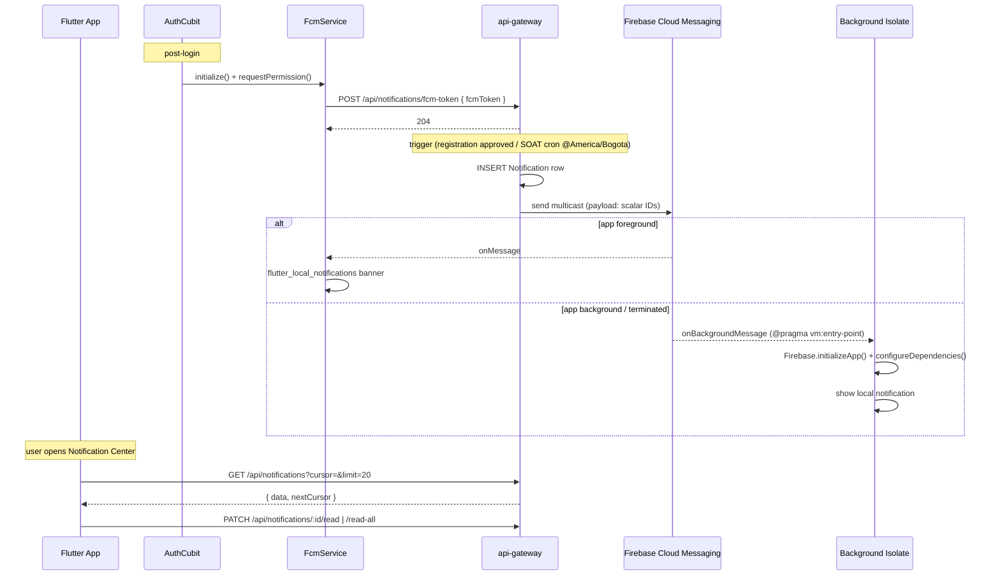

# Architecture Diagrams — Rideglory

> Living document. Updated by Architect each iteration when component hierarchies, boundaries, or data models change.

---

## Iteration 1 — UI/UX Redesign (presentation layer only)

No data model changes this iteration. The diagrams below capture the **design system component hierarchy** as it stands after iter-1, including the two new primitives (`AppEventBadge` atom, `DocumentSlotPill` molecule) extracted from Pencil frames `zKkmE` and `aGqnv` respectively.

### Design system layering

```mermaid
graph TD
  subgraph Foundation
    Tokens["Tokens<br/>app_spacing · app_radius · app_size"]
    Theme["Theme<br/>app_colors · app_text_styles · app_theme"]
  end

  subgraph Atoms
    A_Btn[AppButton]
    A_TBtn[AppTextButton]
    A_TF[AppTextField]
    A_PWTF[AppPasswordTextField]
    A_DD[AppDropdown]
    A_DP[AppDatePicker]
    A_CB[AppCheckbox]
    A_MF[AppMileageField]
    A_CI[AppChipsInput]
    A_TFL[TextFieldLabel]
    A_IC[InfoChip]
    A_DPill[DetailPill]
    A_FC[AppFilterChip]
    A_AB[AppAppBar]
    A_LI[AppLoadingIndicator]
    A_C[AppCard]
    A_ST[AppSectionTitle]
    A_EB["AppEventBadge<br/>NEW · iter-1"]
  end

  subgraph Molecules
    M_AC[AppAutocompleteField]
    M_ACC[AppAutocompleteChipsField]
    M_CA[AppCityAutocomplete]
    M_SB[AppSearchBar]
    M_IP[AppImagePicker]
    M_RTE[AppRichTextEditor]
    M_AD[AppDialog]
    M_CD[ConfirmationDialog]
    M_ID[InfoDialog]
    M_ABS[AppBottomSheet]
    M_ESW[EmptyStateWidget]
    M_NSR[NoSearchResultsEmptyWidget]
    M_ARB[ApproveRejectBar]
    M_CPM[ContactPopupMenuButton]
    M_FSH[FormSectionHeader]
    M_CPR[ContainerPullToRefresh]
    M_DSP["DocumentSlotPill<br/>NEW · iter-1"]
  end

  Theme --> Atoms
  Tokens --> Atoms
  Atoms --> Molecules
  Theme --> Molecules
  Tokens --> Molecules

  A_Btn --> M_ARB
  A_TF --> M_AC
  A_TF --> M_ACC
  A_TF --> M_CA
  A_TF --> M_SB
  A_C --> M_DSP
  A_IC --> M_DSP
```



### Iter-1 consumer map for new primitives

```mermaid
graph LR
  subgraph DesignSystem
    AEB["AppEventBadge (atom)<br/>frame zKkmE"]
    DSP["DocumentSlotPill (molecule)<br/>frame aGqnv"]
  end

  subgraph EventsFeature
    EL[event_list_page]
    ED[event_detail_page]
    UPC[upcoming_events_card<br/>(Home)]
  end

  subgraph VehiclesFeature
    VD[vehicle_detail_page]
    VF[vehicle_form_page<br/>(non-functional placeholder)]
  end

  AEB --> EL
  AEB --> ED
  AEB --> UPC
  DSP --> VD
  DSP --> VF

  DSP -. "iter-2 reuse" .-> SOAT[soat_status_badge<br/>iter-2]
```

### Module-scoped PR sequence



### Color tokenization decision flow (per-file)

```mermaid
flowchart TD
  Start[Encountered Color literal<br/>in lib/features/] --> Q1{Has semantic<br/>role?}
  Q1 -- yes --> CS[Theme.of(context)<br/>.colorScheme.&lt;role&gt;]
  Q1 -- no --> Q2{Mapped in<br/>AppColors?}
  Q2 -- yes --> AC[AppColors.&lt;constant&gt;]
  Q2 -- no --> Q3{Status indicator?}
  Q3 -- yes --> ST[AppColors.success/<br/>warning/error/info]
  Q3 -- no --> Add[Add new constant<br/>to AppColors<br/>+ note in PR]
  CS --> Done
  AC --> Done
  ST --> Done
  Add --> Done[dart analyze]
```

---

## Iteration 2 — SOAT + Notification Foundation

Iter-2 introduces new persisted entities and async flows. ERD covers the new backend tables; sequence diagrams cover the SOAT save flow and the FCM notification lifecycle (foreground + background isolate).

### ERD — new entities



`Soat` lives in vehicles-ms. `Notification` lives in api-gateway's first-ever Prisma schema. `fcmToken` is added to `User` in users-ms.

### Sequence — SOAT save + client-side status



### Sequence — FCM notification lifecycle



---

## Change log

- 2026-05-14 (iter-1): Initial diagrams document created. Captures design-system layering, new iter-1 primitives (`AppEventBadge`, `DocumentSlotPill`) and their consumers, module PR sequence, and color tokenization decision flow. No ERD or sequence diagrams — iter-1 introduces no new data models or async flows.
- 2026-05-14 (iter-2): Added ERD for new entities (`Soat` in vehicles-ms, `Notification` in api-gateway, `fcmToken` on `User` in users-ms). Added sequence diagrams: SOAT save flow (with client-side status computation) and FCM notification lifecycle (token registration, trigger+insert+multicast, foreground vs background-isolate handling, cursor-paginated read).
