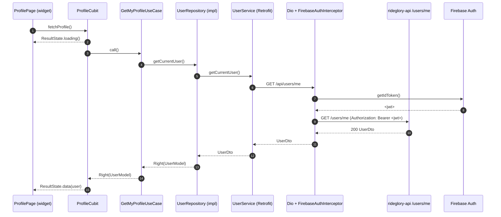
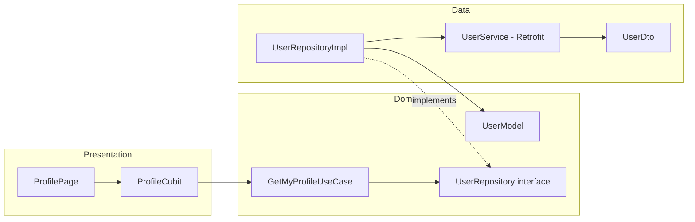

# Architecture diagrams — Rideglory

> Living document. Append new diagrams per iteration when data model or boundaries change.

---

## Iteration 1 — Profile fetch flow

No data model changes (no new entities, no schema migration). The only architectural addition is a presentation-layer cubit + a domain use case wrapping the existing `UserRepository`. Diagram below shows the request flow for the profile page on first render.

### Error variant
On any failure (network, 401, 5xx) the chain returns `Left(DomainException)` and `ProfileCubit` emits `ResultState.error`. The page renders an error banner + retry button; tapping retry restarts the sequence above.

---

## Logical layering (unchanged, recap)

Dependencies flow inward toward `Domain`. `Data` and `Presentation` both depend on `Domain`; never the reverse.

---

## ERD

No entity changes this iteration. Existing `User` (Prisma) and `Vehicle` (Prisma) tables are untouched. ERD will be introduced when SOAT module lands in Iteration 3a.

---

## Change log
- 2026-05-12 (iter-1): Initial diagrams. Profile fetch sequence + layer recap. No ERD yet.
